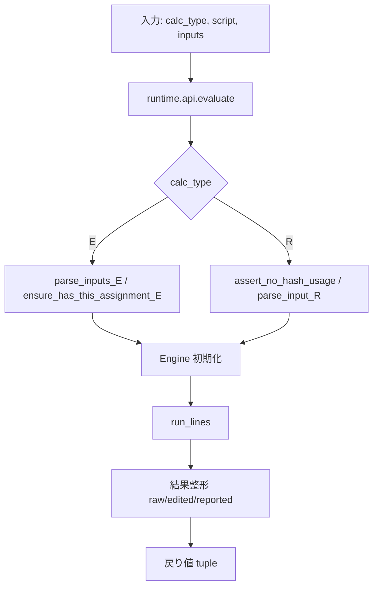

# 2. 全体概要（What）

## 2.1 ツールの提供機能

- Lab-Aid 計算式評価: 推定計算 (E) と丸め計算 (R) を Python ランタイムで互換実行し、既存システムと同一結果を返す。
- Excel CLI 実行: `lab_aid/excel_cli.py` で Excel ブックを読み込み、各行のスクリプトを一括評価して結果を書き戻す。
- Windows バッチ連携: `windows/run_lab_aid.cmd` や `windows/setup_lab_aid.ps1` から CLI を呼び出し、利用者が Python を意識せず実行できるようにする。
- テスト自動化: `pytest tests/engine_test.py` で E/R の代表スクリプトやエッジケースを回帰テストし、仕様逸脱を検知する。

## 2.2 処理フロー

1. API 呼び出し層で calc_type（E or R）とスクリプト、入力文字列／単一値を受け取る。
2. `runtime.inputs` で Lab-Aid 固有フォーマットを解析し、`Engine` が扱える辞書や `VarRef` に変換する。
3. `runtime.engine_core.Engine` がスクリプトを 1 行ずつ実行し、IF/ELSE/END・FOR/NEXT・ビルトイン呼び出しを処理する。
4. 実行結果は `this` の最終値、`print` 系の出力、`var_formats` の表示ヒントをもとに `(raw, edited, reported)` へ整形されて返る。

## 2.3 入力・出力

**入力**
- `calc_type`: `"E"` または `"R"`。
- `script`: Lab-Aid 記法の複数行文字列。`IF/ELSE/END`、`FOR/NEXT`、代入、ビルトイン呼び出しを含められる。
- `inputs` (E): `#CODE[UNIT]=値` 形式の複数行文字列。値は数値・単一引用符で囲んだ文字列・カンマ区切りリストを許容。
- `input` (R): 数値 / `'文字列'` / 通常変数名。第 3 引数として単一値を受け取る。

**出力**
- `raw_text`: E モードのみ。`this` の最終値を Lab-Aid 互換形式で整形した文字列。
- `edited_text`: `print` または `this` の表示文字列。R モードでは入力リテラルをそのまま返すこともある。
- `reported_text`: `print2` または `this` の表示文字列。R モードでは入力リテラルをそのまま返すこともある。

## 2.4 外部インターフェース

- Python API: `lab_aid.engine.evaluate(calc_type, script, inputs)` を呼び出して結果タプルを取得。
- CLI: `python -m lab_aid.excel_cli --input windows/lab_aid_input.xlsx` でブックを一括処理。
- Windows 配布物: `windows/run_lab_aid.cmd` / `windows/setup_lab_aid.ps1` が CLI を呼び出し、配布環境での実行を補助。
