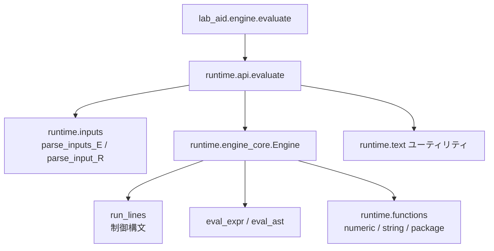

# lab_aid ライブラリ引き継ぎガイド

## 1. ライブラリの目的

- 検査支援ツール「Lab-Aid」のスクリプトを Python 上で評価するための実行エンジン。
- Excel などが出力する Lab-Aid 言語（E: 計算／R: 丸め）の互換実行と、ビルトイン関数のラップを提供。
- 外部システムは `lab_aid.engine.evaluate` もしくは `lab_aid.runtime.api.evaluate` を介して結果文字列（raw / edited / reported）を取得する。

## 2. ディレクトリ構成と責務

- `src/lab_aid/engine.py`  
  公開 API。`Engine`, `VarRef`, `evaluate` を re-export。簡易デバッグ用スタンドアロン実行もここ。
- `src/lab_aid/runtime/api.py`  
  E/R それぞれの評価フロー。入力値のパース・`Engine` の準備・結果の整形／エラーフォールバックまでを担当。
- `src/lab_aid/runtime/engine_core.py`  
  Lab-Aid スクリプト（IF/ELSE/END, FOR/NEXT, 代入, print 系）を逐次実行するコア。状態管理と式評価を提供。
- `src/lab_aid/runtime/inputs.py`  
  `#HOLDER`, `#ITEM[UNIT]` 形式の入力値を辞書化。R モード専用の `VarRef` 解析もここ。
- `src/lab_aid/runtime/text.py`  
  数値パース、コメント除去、キーワード置換、#変数名バリデーションなどのユーティリティ。
- `src/lab_aid/runtime/constants.py`  
  実行時制限（ネスト深度・FOR 繰り返し上限）。
- `src/lab_aid/runtime/functions/`  
  数値・文字列・パッケージ固有（print 系）の各種ビルトイン関数と共通ヘルパ。
- `tests/`  
  Pytest で E/R 双方の代表ケースと異常系を網羅。`tests/engine_test.py` が中心。

### 2.1 高レベル構成

```text
lab_aid.engine.evaluate
 ├─ runtime.api.evaluate
 │   ├─ inputs.parse_*()
 │   ├─ Engine(...) 初期化
 │   └─ Engine.run_lines()
 │        ├─ exec_assign()
 │        ├─ exec_function_statement()
 │        └─ eval_expr()
 └─ runtime.text / runtime.functions
```



| モジュール | 主な責務 | 備考 |
| --- | --- | --- |
| `lab_aid.engine` | 外部公開 API (`evaluate`, `Engine`, `VarRef`) を提供。 | CLI 実行でサンプル確認も可能。 |
| `runtime.api` | E/R タイプ判定、入力パース、`Engine` 起動、戻り値整形。 | フロントドア。 |
| `runtime.engine_core` | Lab-Aid スクリプトの逐次実行と式評価。 | ネスト・反復制限を内蔵。 |
| `runtime.inputs` | Lab-Aid 専用の入力パーサと `VarRef` 解決。 | E/R で処理分岐。 |
| `runtime.text` | コメント除去やキーワード置換などの文字列操作。 | パーサやエンジンから共通利用。 |
| `runtime.functions` | 数値/文字列/print 系のビルトイン関数群。 | `NUMERIC_FUNCTIONS` などをエクスポート。 |

> 詳細な設計は `docs/design/engine/00_engine_overview.md` および各章
> (`01_background_purpose.md` 〜 `09_maintenance_notes.md`) を参照してください。

- 文字列ビルトイン (`runtime/functions/string.py`) は Shift_JIS のバイト長でサブストリングを扱い、`str_comp` については Lab-Aid 仕様に合わせて「第1引数は変数/試験項目のみ」「3 引数形は試験回が変数、比較対象が文字リテラル」という制約を実装済み。
- 桁落ち防止のため、`roundjisb` などが返すフォーマットヒントは `Engine.var_formats` に保持され、通常変数への代入や `strcat`/`strncpy` のような文形式関数を経由しても表示桁が維持される。

## 3. 実行フロー概要

1. `evaluate(calc_type, script, inputs)` が呼ばれる。
2. `calc_type` を正規化し、`E` / `R` 以外なら即 `ValueError`。
3. `E` モード:
   - `ensure_has_this_assignment_E` が `this = ...` の存在を検証。
   - `parse_inputs_E` が `#CODE[UNIT]=value` 行を辞書 (`items`) へ取り込み。（複数値はリスト化）
   - `Engine(items=..., vars={"this": 0})` を生成して `run_lines()` を実行。
   - `this` が未代入ならエラー。成功時は
     - `raw_text`: `this` のフォーマット済み文字列（`roundjisb` などのヒント優先、ない場合は `to_text`）。
     - `edited_text`: `print(this, ...)` の最終値。
     - `reported_text`: `print2(this, ...)` の最終値。
4. `R` モード:
   - `#` 変数使用が禁止されているため、スクリプト・入力双方をチェック。
   - `parse_input_R` が第3引数を数値／文字列／通常変数参照 (`VarRef`) に解釈。`VarRef` は初期値 0、数値／文字列は `this` に初期代入。
   - スクリプト RHS の `this` を `__THIS_IN__` に置換して `Engine` に投入。
   - 実行後、`print` / `print2` の有無、`this` 代入の有無に応じて `edited_text` / `reported_text` を決定。
   - 例外発生時は `(None, "エラー", "エラー")` を返す。

## 4. `Engine` コアのポイント（`src/lab_aid/runtime/engine_core.py`）

- 状態:
  - `items`: `#` で参照される検査項目値（`dict`）
  - `vars`: 通常変数＋`this` の現在値（大文字小文字を意識して保持）
  - `var_formats`: `roundjisb` 等で得た書式ヒントを保持し、代入後の表示値を記憶
  - `last_print`, `last_print2`: 直近の `print` / `print2` 出力
  - `this_assigned_count`, `this_formatted`: `this` 代入の回数・フォーマット済み文字列
- メイン処理:
  - `strip_comment_quote_aware` で `;` コメントを除去した後、1 行ずつ命令判定。
  - `print`, `print2` は正規表現で検出し、`#ITEM` 直接使用を禁止。
  - IF/ELSE/END, FOR/NEXT のネストは `MAX_NEST_DEPTH` まで。FOR ループは最大 `MAX_FOR_ITERS` 回。
  - `exec_assign`: 代入のみ許可。左辺は通常変数または `this`。右辺は `eval_expr` が Lab-Aid 式として評価。
  - `exec_function_statement`: `strcat`, `strncpy` のような「戻り値を代入する statement 関数」をサポート。
- 式評価 (`eval_expr`):
  - `#CODE[UNIT]` を `items` から解決（`VarRef` は通常変数参照）。
  - 比較演算は Lab-Aid 表記 (`eq`, `gt` など) を Python 演算子に置き換え。
  - 関数呼び出しは `FUNCTION_DISPATCH`（数値＋文字列関数）でディスパッチし、戻り値は `BuiltinNumericResult`。
  - `str_comp` の特殊バリデーション（第1引数にリテラル不可、試験回指定の型チェック）を `_validate_call` で実行。

## 5. 入出力フォーマット

- E 入力 (`parse_inputs_E`):
  - 形式: `#CODE[UNIT]=value`（`#` は省略可）。複数値はコンマ区切り、単一引用符を 2 連でエスケープ。
  - 値は数値 or `'文字'`。複数指定時はリスト化され、ビルトイン関数が参照する。
- R 入力 (`parse_input_R`):
  - 数値、`'文字'`、または通常変数名のいずれか 1 つ。
  - 通常変数名は `VarRef` としてエンジンに渡され、実行前は 0 で初期化。数値／文字列の場合は `this` と `__THIS_IN__` の両方に初期代入される。
- 戻り値（`evaluate`）:
  - E モード: `(raw_text, edited_text, reported_text)`
  - R モード: `(None, edited_text, reported_text)`
  - いずれも例外時は `"エラー"` を返却（R は edited/reported がエラーに固定）。

## 6. ビルトイン関数一覧（概要）

- 数値系（`runtime/functions/numeric.py`）
  - 四則演算補助: `sqrt`, `log`, `log10`, `exp`, `pow`
  - 整数/小数操作: `modi`, `modd`, `round`, `roundjisb`, `floor`, `trunc`
  - 集約系: `max`, `min`, `ave`, `sum`, `stdev`, `stdeva`
  - `roundjisb` は `format_hint` を返し、`roundjisb_output` が末尾ゼロを保持する文字列を生成。
- 文字列系（`runtime/functions/string.py`）
  - 判定: `str_comp`, `is_char`, `isempty`, `isspace`
  - 取得: `strlen`
  - ステートメント関数: `strcat`, `strncpy`（Shift_JIS バイト長を考慮）
- パッケージ関数（`runtime/functions/package.py`）
  - `print`, `print2` のラッパ。引数式を評価し、`to_text` で文字列化。

### 新しいビルトインを追加する手順

1. `runtime/functions/base.py` に共通処理があれば追記。
2. 数値系なら `numeric.py` に関数を実装し、`NUMERIC_FUNCTIONS` に登録。
3. 文字列系なら `string.py` に実装し、`STRING_FUNCTIONS` に登録。
4. 必要に応じて `engine_core.FUNCTION_DISPATCH` または `STATEMENT_FUNCTIONS` を更新。
5. Pytest で正常系／境界値／異常系をカバーするテストを追加。

## 7. エラーハンドリング指針

- Lab-Aid 仕様上、想定外入力は「エラー文字列」で返す方針。Python 例外は API 層で捕捉し、文字列へ変換。
- 例外発生箇所:
  - パーサ (`parse_inputs_E`, `parse_input_R`) のフォーマットチェック。
  - `Engine.run_lines` の構文・制御フロー（IF/ELSE/END, FOR/NEXT）の整合性。
  - ビルトイン関数の引数バリデーション。
- 新機能追加時は、例外種別（`ValueError`, `TypeError`, `RuntimeError`, `SyntaxError`）を既存と合わせる。

## 8. テスト・開発フロー

- 依存管理: `uv` と `just` を利用。

  ```sh
  just setup  # 初回のみ。uv sync と prek install を実行
  just sync   # 依存アップデートや日次作業前に実行
  just format # ruff format
  just lint   # ruff check + mypy + bandit
  just test   # pytest -n auto --cov=src
  ```

- 単体テスト:
  - `tests/engine_test.py` が全主要機能をカバー。ケース追加時は E/R モード両方での挙動を検証。
  - `pytest -k "<keyword>" -vv` で個別実行が可能。
- カバレッジレポート（`htmlcov/`）がリポジトリに残っているため、必要に応じて
  `uv run pytest --cov=src --cov-report=term-missing` → `uv run coverage html`
  といった手順で更新する。

## 9. 拡張・保守のヒント

- 入力パーサの共通処理（引用符・コメント・大小文字）を変更する場合は、`text.py` のユーティリティ経由に統一する。
- `Engine.eval_expr` で Python `ast` を使用しているため、新しい構文サポートは AST ノード追加が必要。
- `MAX_NEST_DEPTH` や `MAX_FOR_ITERS` は環境要件に応じて調整可能（`runtime/constants.py`）。
- 既存仕様に無い構文を導入する場合は、ネイティブ Lab-Aid との互換性リスクを必ず明記し、互換テストを追加。

## 10. 既知の制約・TODO

- `print` / `print2` の戻り値は最新呼び出しのみ保持（複数回呼び出し時は上書き）。
- Lab-Aid で許容される全ビルトインを網羅しているわけではない。追加要望があればテストから逆算して実装。
- R モードでは `this` 以外の通常変数初期値を外部から与えられない（必要なら API 拡張が必要）。

## 11. Windows セットアップ（埋め込み Python の自動取得）

Windows 11 環境で Python をインストールせずに運用する場合は、リポジトリ同梱の
PowerShell スクリプトで公式の埋め込み Python を取得・展開できます。
ユーザー向け配布手順は `windows/README.md`（ユーザーガイドライン）にまとめてあるため、
本節では開発者視点での補足のみ記載します。

1. エクスプローラーで `windows/setup_lab_aid.cmd` を右クリックし、「管理者として実行」を選択します（ダブルクリックでも可）。  
   スクリプトが自動的に埋め込み版 Python・依存パッケージを展開し、`licenses/` と `lab_aid.bat` を生成します。

   - `-PythonVersion 3.13.0` などで取得するバージョンを変更可能（デフォルトは 3.13.0 64bit）。  
   - 既存の `runtime\python` を上書きしたい場合は `-Force` を付与します。  
   - スクリプトは Python 本体（Embed 版）と `get-pip.py`・依存パッケージ（openpyxl 等）をインターネット経由でダウンロードします。
   - コマンドで直接実行したい場合は `windows/setup_lab_aid.ps1` を呼び出してください（付録参照）。
2. `windows` フォルダに生成された `lab_aid_input.xlsx` を開き、1 行目（入力/出力）・2 行目（項目名）がテンプレートとして用意されていることを確認のうえ、以下の列にデータを入力します。複数件を処理したい場合は行を追加してください。  
   - A 列: `計算式タイプ`（E または R）
   - B 列: `計算式`（セル内改行で複数行を記述）
   - C 列: `変数`（`A=5` など。複数値はセル内改行）
   - D〜F 列: `生データ` / `編集後` / `報告値`
   - G 列: `status`
3. 入力後、`windows` フォルダ内の `run_lab_aid.cmd`（または自動生成された `lab_aid.bat`）をダブルクリックすれば計算を実行できます。  

   ```cmd
   C:\path\to\lab-aid> windows\run_lab_aid.cmd
   C:\path\to\lab-aid> windows\run_lab_aid.cmd --help
   ```

   直接 Python を呼び出す場合は `runtime\python\python.exe -m lab_aid.excel_cli` を使用してください。
   実行結果は `windows/lab_aid_input.xlsx` の `生データ` / `編集後` / `報告値` 列および `status` 列に書き戻されます。

埋め込み版 Python と依存ライブラリ（`openpyxl` など）には各プロジェクトのライセンスが適用されます。セットアップスクリプト完了後、`licenses/` 配下に Python 本体および主要依存のライセンス写しが自動生成されるので、配布時は `LICENSE` と併せて必ず同梱してください。

> 補足: 詳細な構成およびスクリプトの振る舞いは `docs/lab_aid_design.md` と `windows/setup_lab_aid.ps1` のコメントを参照してください。エンドユーザー向けのステップバイステップ手順は `docs/user_setup_guide.md` を参照してください。

## 12. 参考

- 既存テストケース: `tests/engine_test.py`
- util ドキュメント: リポジトリ直下の `推定計算と丸め計算の文法.pdf`
- クイック確認: `python -m lab_aid.engine` を実行すると、サンプル E/R ケースの評価が可能。
